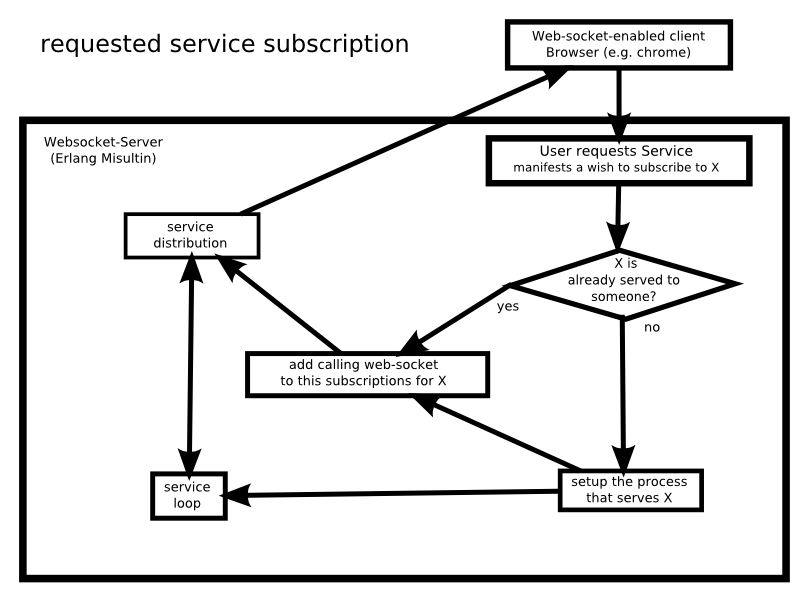

==========================================================================================================

**JAGST - Websockets & Erlang** - Examples for Misultin websocket usage.  
<http://github.com/kr1/jagst>
  
 
<code>  

\\\\\\\\\\\\\\\\\\\\\\\\\\\\\\\\\\\\\\\\\\\\\\\\\\

>>    \>-|-|-(°>

/////////////////////////

</code>  
  
   
ABOUT
-----

***JAGST*** is a project to explore (and make available) some simple usages of the combination of **websockets** and **Erlang**.  
The **websockets** provide the _real-time connectivity_ and **Erlang** the light-weight processes to handle these connections.  
Furthermore, in a certain sense the browser is just another _actor_ in the Erlang _actor paradigm_ - sending and receiving messages but not sharing memory. We use the excellent light-weight [***Misultin***](http://github.com/ostinelli/misultin) http server library.

we currently have two example applications, they follow different approaches:

1.  **schmotz** 

    is a peer-(broad)-cast application where data travels from 1-to-many users.
    it is a collaborative painting application along the lines of http://colorillo.com, but much more basic and raw.

    

2.  **deli**

    is a _subscription_ application in which the service gets created only upon requests 
    a user subscribes to a **delicious** (tm) tag or tag-combination and will receive new entries pushed to his browser (on the server there is a rss-polling process for every tag/combination active for a given moment)

    

INSTALL INSTRUCTIONS
-------------------

1.  **Compile**

    Run the appropriate script:

    * OSX | Linux users:  make

    This script will compile the .erl files in the Misultin src directory and save the compiled files into the ebin directory.

2.  **Run**

    * CD to the ebin directory: *cd ebin*
    * fire up an erlang shell: *erl*
    * start the misultin server and jagst application on a specified port: jagst_ws_handler:start(8080)
    * Open a websocket-speaking browser (google chrome, e.g.) and point it to http://localhost:8080/schmotz for the **schmotz**-app OR http://localhost:8080/deli for the **deli**-app.

DOCUMENTATION
-------------

Misultin's **API Documentation** is available online on the Misultin's wiki: [http://code.google.com/p/misultin/wiki/](http://code.google.com/p/misultin/wiki/ "misultin wiki")
